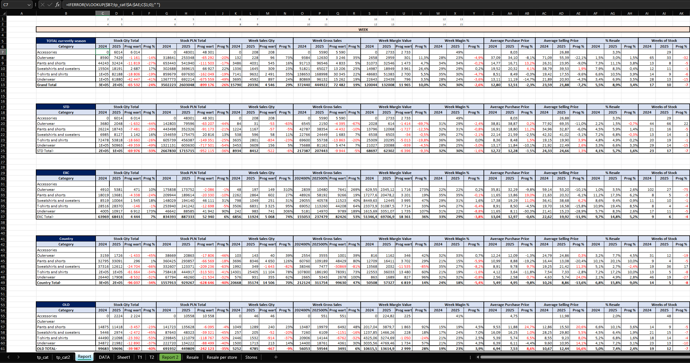

# weekly_clothes_retail_sales_and_inventory_analysis

## 🎯 Project Goal

This project simulates the analytical workflow I currently perform in my professional role in retail sales and inventory analysis.
The repository presents a simplified version of Excel based reporting structures used to analyze weekly sales performance and product inventory. The dataset included in this project was generated with AI support and manually adjusted to resemble real business data while remaining fully simulated for portfolio purposes.

## 📥 Data Collection

At the beginning of each week, sales data from the previous week as well as cumulative sales data are exported from Tableau.
However, the Tableau reports don't contain all product attributes required for detailed analysis,for clothes.
Additionally, the reporting system doesn't allow exporting both weekly and cumulative sales data for articles in a single report. Because of this limitation, I need to extract two separate datasets and then integrate them into a single analytical structure.
To combine these datasets efficiently, I use Excel-based matrices built on pivot table logic, which allow me to align and merge the results from both exports. This approach significantly speeds up the data preparation process and enables consistent comparison between weekly and cumulative performance.

## 🧩 Data Enrichment

To complete the dataset, additional product information is retrieved using Excel lookup functions (primarily VLOOKUP) from supplementary files stored locally.

These files contain key product attributes such as:

- Model number

- Color

- Size

- Initial selling price

- Transfer price

- Season classification (Winter / Summer)

- Regional coordinator responsible for a product group

Each product has a unique product number, which allows missing attributes to be matched and appended to the Tableau export files.
During this stage, basic **data cleaning 🧹 and validation 🧱** is also performed to ensure data consistency. This includes checking for missing values, verifying product identifiers, standardizing attribute formats, and removing inconsistencies between the exported datasets and the reference product lists.

## ⚙️ Product Data Management

As part of my responsibilities, I also maintain internal product reference files used for data enrichment. This includes:

- assigning product codes in internal company systems

- uploading product prices to stores system

- maintaining seasonal product lists

- organizing articles by year and season

- creating consolidated product reference tables

These structured files serve as lookup tables that allow missing attributes to be automatically appended to the main dataset.

In my current role I'm responsible for three product departments, and I process approximately 1 million records per week.
Due to corporate system limitations (access restricted to Excel), the data is distributed across multiple files to stay within Excel row limits.

## ⚠️ Data Disclaimer

All datasets used in this repository are fully simulated and were generated with AI assistance and manual adjustments. The structure of the files reflects real analytical workflows what I do, but the data itself does not contain any confidential or proprietary business information.
Despite being simulated, the dataset preserves realistic business logic and allows the creation of meaningful analytical insights. The results presented in this project demonstrate how data can be explored, interpreted, and transformed into business storytelling similar to real retail analysis.

## 🛠 Tools & Technologies

- **Microsoft Excel** – used to prepare the business results file, integrate datasets, and structure the analytical model.
- **AI (ChatGPT)** – used to generate the simulated dataset included in the **"data"** worksheet.

## 📊 Exploratory Business Analysis 

