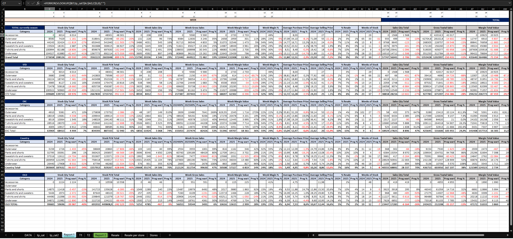
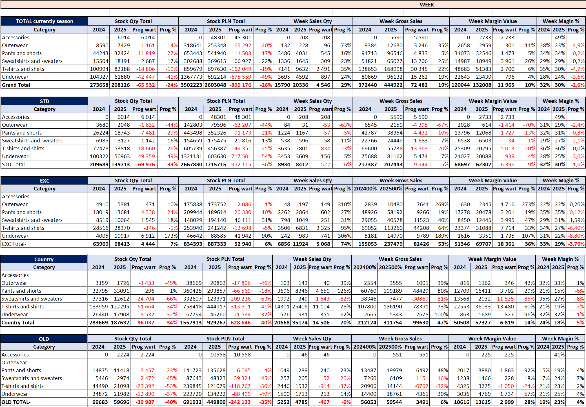

# weekly_clothes_retail_sales_and_inventory_analysis

## 🎯 Project Goal

This project simulates the analytical workflow I currently perform in my professional role in retail sales and inventory analysis.
The repository presents a simplified version of Excel based reporting structures used to analyze weekly sales performance and product inventory. The dataset included in this project was generated with AI support and manually adjusted to resemble real business data while remaining fully simulated for portfolio purposes.


## 📥 Data Collection

At the beginning of each week, sales data from the previous week as well as cumulative sales data are exported from Tableau.
However, the Tableau reports don't contain all product attributes required for detailed analysis,for clothes.
Additionally, the reporting system doesn't allow exporting both weekly and cumulative sales data for articles in a single report. Because of this limitation, I need to extract two separate datasets and then integrate them into a single analytical structure.
To combine these datasets efficiently, I use Excel-based matrices built on pivot table logic, which allow me to align and merge the results from both exports. This approach significantly speeds up the data preparation process and enables consistent comparison between weekly and cumulative performance.


## 🧩 Data Enrichment

To complete the dataset, additional product information is retrieved using Excel lookup functions (primarily VLOOKUP) from supplementary files stored locally.

These files contain key product attributes such as:

- Model number

- Color

- Size

- Initial selling price

- Transfer price

- Season classification (Winter / Summer)

- Regional coordinator responsible for a product group


Each product has a unique product number, which allows missing attributes to be matched and appended to the Tableau export files.
During this stage, basic **data cleaning 🧹 and validation 🧱** is also performed to ensure data consistency. This includes checking for missing values, verifying product identifiers, standardizing attribute formats, and removing inconsistencies between the exported datasets and the reference product lists.

## ⚙️ Product Data Management

As part of my responsibilities, I also maintain internal product reference files used for data enrichment. This includes:

- assigning product codes in internal company systems

- uploading product prices to stores system

- maintaining seasonal product lists

- organizing articles by year and season

- creating consolidated product reference tables

These structured files serve as lookup tables that allow missing attributes to be automatically appended to the main dataset.

In my current role I'm responsible for three product departments, and I process approximately 1 million records per week.
Due to corporate system limitations (access restricted to Excel), the data is distributed across multiple files to stay within Excel row limits.


## ⚠️ Data Disclaimer

All datasets used in this repository are fully simulated and were generated with AI assistance and manual adjustments. The structure of the files reflects real analytical workflows what I do, but the data itself does not contain any confidential or proprietary business information.
Despite being simulated, the dataset preserves realistic business logic and allows the creation of meaningful analytical insights. The results presented in this project demonstrate how data can be explored, interpreted, and transformed into business storytelling similar to real retail analysis.


## 🛠 Tools & Technologies

- **Microsoft Excel** – used to prepare the business results file, integrate datasets, and structure the analytical model.
- **AI (ChatGPT)** – used to generate the simulated dataset included in the **"data"** worksheet.


## ⚙️ Excel Report Automation Logic


While the first report provides a high level overview of inventory and sales performance,
the second report allows deeper analysis at category, subcategory and store level.

## Excel Reporting Architecture

The Excel reporting model follows a layered structure where pivot tables act as the aggregation layer and automated reports transform the data into business insights.
```
Raw Data
   ↓
Pivot Tables (tp_cat, tp_cat2, T1, T2)
   ↓
Data Mapping (VLOOKUP / Direct Cell References)
   ↓
Calculated KPI Metrics
   ↓
Automated Reports & Dashboards
```
This structure allows the Excel file to function as a lightweight reporting system combining data aggregation, automated calculations and analytical reporting.

Additionally, the file contains several sheets with simple pivot tables used for quick situational analysis depending on the current needs of the analyst and stakeholders.


## **REPORT 1️⃣**

**Dashboard Logic:**

The first report acts as the main automated dashboard, presenting a high level overview of stock and sales performance across product categories.
The dashboard retrieves aggregated results from pivot tables and transforms them into structured business metrics using lookup formulas and calculated indicators.


**The full report screenshot is included here to present the overall structure and logic of the file. Due to its size, specific sections of the report will be shown separately below to provide clearer analysis and better readability.**

**Data Retrieval**

Data is dynamically retrieved from pivot tables using VLOOKUP formulas with dynamic column references.
This allows the dashboard to automatically update whenever the pivot tables are refreshed while maintaining a consistent report structure.


Two pivot tables act as the data aggregation layer:

tp_cat 

Provides total results by category and feeds the upper section of the dashboard:
Week & Total currently season


This section summarizes overall stock and sales performance.

tp_cat2 

This pivot table provides a more detailed breakdown of the data, including:
product typology (STD, EXC, COUNTRY, OLD)

The results are structured using category connectors  in columne "A" which allow the dashboard to dynamically retrieve values from the pivot table.


**Dynamic Data Retrieval**

The dashboard retrieves values from pivot tables using a dynamic lookup formula:

```
=IFERROR(VLOOKUP($B7;tp_cat!$A:$AE;C$1;0);" ")

Key elements of this approach:

$B7 – category used as lookup key
tp_cat / tp_cat2 – pivot table data sources
C$1 – dynamic column index controlled by header values
IFERROR – prevents lookup errors when data is missing
```
Numbers placed in the header rows act as column index references, allowing the same formula to populate the entire dashboard without manually adjusting column numbers.

This high-level report serves as the starting point for analysis, while the second report enables deeper exploration at category and store level.


## **REPORT 2️⃣**

Detailed Category & Subcategory Report per total & stores
The second report provides a more granular view of inventory and sales performance, allowing analysis by category, subcategory and individual stores.
The report is powered by two pivot tables, which act as the data aggregation layer.


Pivot Table Data Sources

Two pivot tables supply the report:

**T1**

This pivot table provides aggregated results including:

- product categories
- subcategories
- product typologies (STD, EXC, COUNTRY, OLD)

The data from this pivot table feeds the Total view of the report, allowing users to analyze overall performance.

**T2**

This pivot table contains the same structure as **T1** but includes an additional breakdown per store, allowing detailed performance analysis for each location.

**Direct Cell References**

Unlike the first dashboard which uses VLOOKUP, this report retrieves data using direct cell references from the pivot tables.
This approach allows the report to update automatically whenever the pivot tables are refreshed.
The total section always contains a fixed number of rows, ensuring consistent structure for the aggregated view.
When analyzing individual stores, the number of rows may vary depending on the available data. In cases where fewer rows exist, empty results appear as 0 values, while additional records can be quickly incorporated by extending formulas downward.


**Subtotals**

Subtotals were added above the column headers using Excel SUBTOTAL functions, allowing the report to dynamically recalculate totals when filters are applied.
This enables flexible analysis depending on selected views.

**Report Navigation**

The report can be analyzed at two different levels.

**Total View**

By selecting TOTAL in the Store or Store Number filter, users can analyze the overall performance across all stores.
Subcategory value 0 is excluded from the view, as it represents aggregated totals rather than individual product groups.

**Store-Level View**
To analyze a specific store, users simply select the desired store name from the filter.
For example:
Selecting Białystok displays the full category and subcategory performance for that store.

**Reporting Logic**

The report follows the structure below:
This structure enables flexible analysis across both overall performance and store-level results.


## 📈 **Key Retail Metrics Explained**


The dashboard focuses on several key metrics commonly used in retail inventory and sales analysis.
These indicators help evaluate stock efficiency, pricing strategy and sales performance.

Average Purchase Price measures the average cost at which products were purchased.
This metric helps monitor whether procurement costs change over time and supports margin analysis.
```
=Total Purchase Value / Stock Quantity
2024: =IFERROR(G7/C7;"")
2025: =IFERROR(H7/D7;"")
```


Average Selling Price

Average Selling Price measures the average price at which products were sold.
This KPI helps identify pricing trends and evaluate the effectiveness of pricing strategies.

```
=Total Sales Value / Units Sold
2024: =IFERROR(O7/K7;"")
2025: =IFERROR(P7/L7;"")
```

% Resale

The Resale Percentage shows what portion of the available stock was sold during the analyzed period.

```
=Sales Quantity / (Sales Quantity + Stock Quantity)
2024: =IFERROR(K7/(K7+C7);"")
2025: =IFERROR(L7/(L7+D7);"")
```

Weeks of Stock (WOS) / Stock Coverage (SC)

Weeks of Stock shows how many weeks the current inventory can support sales at the current sales pace.

```
=Stock Quantity / Weekly Sales
2024: =IFERROR(C7/K7;"")
2025: =IFERROR(D7/L7;"")
```

Year-over-Year Value Difference

Year-over-Year value difference shows the absolute change between two periods.

```
=Current Year Value - Previous Year Value
=IFERROR(D7-C7;"")
```

Year-over-Year Change (%)

Year-over-Year percentage change measures the relative growth or decline between two periods.

```
=(Current Year Value / Previous Year Value) - 1
=IFERROR(D7/C7-1;"")
```

 
## 🎨 Conditional Formatting

Conditional formatting was applied to the Year-over-Year indicators:

- Prog %

- Prog Value

Negative values are automatically highlighted in red, which allows users to quickly identify declines in performance compared to the previous year.

This visual rule helps highlight situations where:

- stock decreased

- sales dropped

- resale performance weakened

By automatically emphasizing negative changes, the report makes it easier to detect potential issues in inventory or sales dynamics without manually reviewing each value.

```
Conditional rule: Value < 0 → red text
```


## 📊 Exploratory Business Analysis


## **REPORT 1️⃣**




Left site of Report 1 

Weekly Sales & Inventory Performance

The analysis focuses on weekly sales performance and inventory structure across product categories, with particular attention to the Current Season assortment.
The company's strategy for 2025 focused on reducing excess inventory while improving the product mix, prioritizing better assortment quality and better offer instead of maintaining high stock levels.
The results suggest that lower stock levels did not negatively impact sales performance, indicating a healthier inventory structure and improved demand alignment.


**Current Season Performance (TOTAL Currently Season)**

The Current Season assortment represents the core product offering and therefore plays the most important role in overall business performance.

**Inventory Optimization**

Total stock levels for current season products decreased from:
- 273,658 units (2024)
- 208,126 units (2025)

This represents a 24% reduction in inventory.

Despite the lower stock level, weekly sales increased significantly:

- 372,440 → 444,922 units
- +19% growth in weekly sales

This suggests that the inventory reduction strategy improved stock efficiency rather than harming sales performance.
Lower inventory combined with higher sales indicates stronger demand alignment and better assortment selection.


**STD – Standard Assortment**

The STD segment represents the core regular assortment
and therefore reflects the baseline performance of the collection.
In 2025 the company significantly reduced inventory levels in this segment:

- stock decreased by 33% YoY

- weekly sales decreased only by 6%

This indicates that inventory was reduced more aggressively than demand, suggesting improved assortment selection and more efficient stock management.

Category performance shows mixed results.
Sweatshirts and sweaters performed well, with both stock and sales increasing, indicating strong demand in this segment.
On the other hand, outerwear experienced the largest decline in sales, which may be partially explained by seasonal weather conditions or lower category demand.

Overall, the STD assortment appears to be leaner and more optimized, with lower inventory levels but relatively stable sales performance.


**EXC – Exclusive / Promotional Assortment**

EXC represents products primarily used in promotional campaigns and special offers, which play an important role in driving short-term sales performance.

In 2025 the company increased its focus on this segment. Inventory levels grew slightly:
- Stock: +7% YoY

However, the impact on sales was significantly stronger:
- Weekly sales: +74% YoY

This strong growth suggests that promotional products were actively leveraged as a sales-driving mechanism during the analyzed period, supported by improved product selection before the season.

A key factor behind this strategy is the nature of the EXC assortment. Many of these products include licensed items, which tend to sell quickly due to their recognizable brands and strong customer appeal.
By allocating more space and attention to these products, the company was able to stimulate demand and increase sales velocity, even while reducing inventory in other segments.

From a category perspective, the strongest performance was observed in:

- Pants and shorts
- Sweatshirts and sweaters

Outerwear

Overall, the EXC assortment appears to have played a strategic role in boosting sales and improving inventory turnover, complementing the leaner structure of the standard assortment.

**Country – Local Sourcing Assortment**

Country represents products sourced from local suppliers, which complement the core assortment mainly supplied from the UK. These products provide additional flexibility in assortment planning and allow the company to quickly respond to local market demand.

In 2025 the company significantly reduced inventory levels in this segment:
- Stock: -34% YoY

Despite the lower inventory, sales performance increased strongly:
- Weekly sales: +70% YoY

This indicates that locally sourced products performed very efficiently and were able to generate strong demand with a smaller inventory base.
Such results suggest that the Country assortment may play an important strategic role in supporting the main collection, allowing the business to quickly introduce attractive products with shorter supply chains and better alignment with local customer preferences.
In addition, the improved performance may indicate better product selection and stronger demand for locally sourced items, which can often be introduced faster and adjusted more easily than centrally supplied collections.
Overall, the Country segment appears to function as a flexible support layer for the main assortment, helping to boost sales while maintaining a lean inventory structure.


**OLD – Previous Seasons Inventory**

The OLD segment represents products from previous collections that remained in store inventory. In retail, these products typically have lower sales dynamics and reduced margins, making their management an important part of inventory strategy.

In 2025 the company significantly reduced inventory levels in this segment:
- Stock: -40% YoY

This reduction reflects a clear strategic effort to clean up remaining inventory from older collections and improve the overall freshness of the assortment.
Despite the strong reduction in stock, sales performance remained relatively stable compared to the scale of inventory reduction. This suggests that the company successfully reduced excess stock without significantly impacting demand.
From a retail perspective, lowering the share of old collections in total inventory is highly beneficial because it:

- improves assortment freshness
- reduces storage costs
- frees space for new season products
- increases overall inventory turnover

Overall, the strong reduction in OLD inventory indicates a successful effort to optimize the inventory structure and focus more strongly on current season products, which are typically more attractive for customers.


