# weekly_clothes_retail_sales_and_inventory_analysis


## 🎯 Project Goal

This project shows the analytical workflow I use in my current role in retail clothing sales and inventory analysis. It presents a simplified version of Excel-based reporting used to analyze weekly sales performance and inventory. The dataset was generated with AI support and manually adjusted to resemble real business data, while remaining fully simulated for portfolio purposes.


## 📑 Table of Content
- [Data Collection](#-Data-Collection)
- [Data Preparation](#-data-preparation)
- [Product Data Management](#-Product-Data-Management)
- [Data Disclaimer](#-Data-Disclaimer)
- [Tools & Technologies](#-Tools-&-Technologies)
- [Excel Report Automation Logic](#-Excel-Report-Automation-Logic)
- [Exploratory Business Analysis](#-Exploratory-Business-Analysis)
- [Additional Pivot Analysis](#-Additional-Pivot-Analysis)
- [Future Business Opportunities](#-Future-Business-Opportunities)
- [Key Analytical Insights](#-Key-Analytical-Insights)

## 📂 Data Access

The full analytical file used in this project (including data model, transformations, and dashboard outputs) exceeds GitHub file size limits and is not included directly in the repository.

📥 **Full project file (Excel):**  

👉 [Download here](https://drive.google.com/drive/folders/1DflD_mxzoq3mPHjqHFj1kvemxZfRWp-O?usp=drive_link)

## 📥 Data Collection

At the beginning of each week, I export sales data from Tableau, including both last week’s sales and cumulative sales. However, the reports do not include all product attributes needed for detailed analysis. In addition, it is not possible to export both weekly and cumulative data for articles in a single report. Because of this, I extract two separate datasets and combine them into one structure.
To do this, I use Excel and pivot tables to match and merge the data from both exports. This approach speeds up data preparation and ensures consistent comparison between weekly and cumulative performance.


## 🧩 Data Preparation

To complete the dataset, additional product information is added using Excel lookup functions (mainly VLOOKUP) from local reference files.

These files contain key product attributes such as:

- Model number
- Color
- Size
- Buying price
- Initial selling price
- Season classification (Winter / Summer)
- Regional coordinator responsible for a product group

They also include store names, as the source system provides only store ID's. Based on the store name, the regional coordinator is assigned to each store group.
Each product has a unique product number, which allows missing attributes to be matched and added to the Tableau export files.
At this stage, basic **data cleaning 🧹 and validation 🧱** are performed to ensure consistency. This includes checking for missing values, verifying product identifiers, standardizing formats, and resolving inconsistencies between datasets and reference files.

## ⚙️Product Data Management

As part of my role, I create internal product reference files used for data integration.

This process includes:

- Assigning product codes in internal company systems
- Uploading product prices to store systems
- Maintaining seasonal product lists
- Organizing products by year and season
- Creating consolidated product reference tables

These files act as lookup tables, allowing missing attributes to be added to the main dataset. They also help separate products by season (Spring/Summer vs Autumn/Winter) and assign them to the correct year.
I also keep data consistent across team files by updating control files used for price setting and refreshing all related data after each product update.
In my current role, I am responsible for three product departments and process around 1 million records per week. Due to system limitations (Excel row limits), I prepare separate files for different departments.


## ⚠️ Data Disclaimer

All datasets used in this repository are fully simulated and were generated with AI assistance and manual adjustments. The structure of the files reflects real analytical workflows I use in my work, but the data itself does not contain any confidential or proprietary business information.
Despite being simulated, the dataset follows realistic business logic and allows for meaningful analysis. The results presented in this project show how data can be explored, interpreted, and turned into business insights, similar to real retail analysis.


## 🛠 Tools & Technologies

- **Microsoft Excel** – used to prepare reporting files, combine datasets, and structure the analytical model.
- **AI (ChatGPT)** – used to generate the simulated dataset included in the "data" worksheet.


## ⚙️ Excel Report Automation Logic


While the first report provides a high level overview of inventory and sales performance,
the second report allows deeper analysis at category, subcategory and store level.

## Excel Reporting Architecture

The Excel reporting model is built in layers, with pivot tables aggregating the data and reports turning it into business insights.
```
Raw Data
   ↓
Pivot Tables (tp_cat, tp_cat2, T1, T2)
   ↓
Data Mapping (VLOOKUP / Direct Cell References)
   ↓
Calculated KPI Metrics
   ↓
Automated Reports & Dashboards
```

This structure allows the Excel file to work as a simple reporting system, combining data aggregation, automated calculations, and analysis.
Additionally, the file includes several sheets with simple pivot tables used for quick, ad hoc analysis depending on the needs of the analyst and stakeholders..


## **REPORT 1️⃣**

**Dashboard Logic:**

The first report acts as the main dashboard, providing a high-level overview of stock and sales performance across product categories.
It pulls aggregated data from pivot tables and turns it into structured business metrics using lookup formulas and calculated indicators.


**A full report screenshot is included to show the overall structure and logic of the file. Due to its size, selected sections are presented separately below in the "Exploratory Business Analysis" section for better clarity and readability.**

**Data Retrieval**

Data is pulled from pivot tables using VLOOKUP formulas with dynamic column references.
This allows the dashboard to update automatically when the pivot tables are refreshed, while keeping a consistent structure.


Two pivot tables act as the main data aggregation layer:

tp_cat

Provides total results by category and feeds the upper section of the dashboard (Week & Total – Current Season).
This section summarizes overall stock and sales performance.

tp_cat2

Provides a more detailed breakdown of the data, including:
- Product typology (STD, EXC, COUNTRY, OLD)

The results are structured using category connectors in column "A", which allow the dashboard to dynamically retrieve values from the pivot table.


**Dynamic Data Retrieval**

The dashboard retrieves values from pivot tables using a dynamic lookup formula:

```
=IFERROR(VLOOKUP($B7;tp_cat!$A:$AE;C$1;0);" ")

Key elements of this approach:

$B7 – category used as lookup key
tp_cat / tp_cat2 – pivot table data sources
C$1 – dynamic column index controlled by header values
IFERROR – prevents lookup errors when data is missing
```
Numbers placed in the header rows act as column references, allowing the same formula to be used across the entire dashboard without manual adjustments.
This report serves as the starting point for analysis, while the second report allows for deeper exploration at the category and store level.


## **REPORT 2️⃣**

Detailed Category & Store Level Report
The second report provides a more detailed view of inventory and sales performance, allowing analysis by category, subcategory, and individual stores.
It is powered by two pivot tables, which act as the main data aggregation layer.

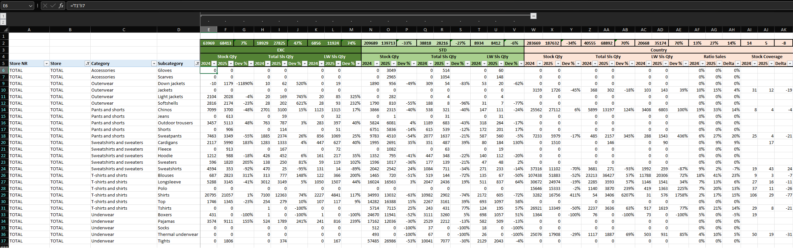
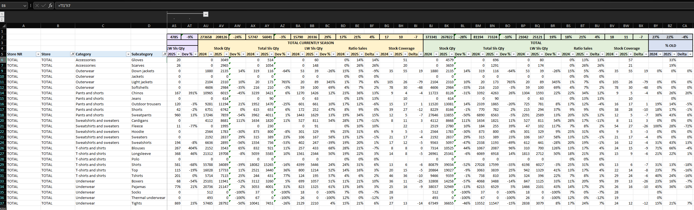
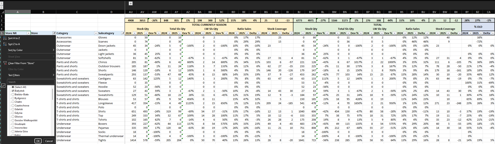

**The screenshots above are included to show the structure and functionality of Report 2. The main business analysis in this project is based on Report 1 and selected pivot tables, which provide an overview of stock and sales performance. Report 2 serves as a supporting tool for deeper analysis at the category, subcategory, and store level. The images are included to illustrate how the report is structured.**


Pivot Table Data Sources

Two pivot tables supply the report:

**T1**

This pivot table provides aggregated results by:

- Product category
- Subcategory
- Product typology (STD, EXC, COUNTRY, OLD)

The data feeds the Total view of the report, allowing users to analyze overall performance.

**T2**

This pivot table follows the same structure as **T1** but includes an additional breakdown by store, allowing detailed performance analysis for each location.

**Direct Cell References**

Unlike the first dashboard, which uses VLOOKUP, this report retrieves data using direct cell references from pivot tables.
This allows the report to update automatically whenever the pivot tables are refreshed.
The Total section always has a fixed number of rows, ensuring a consistent structure for aggregated results.
When analyzing individual stores, the number of rows may vary depending on the data. If fewer rows are available, missing values appear as 0. Additional records can be easily included by extending the formulas downward.


**Subtotals**

Subtotals are placed above the column headers using Excel SUBTOTAL functions, allowing totals to update automatically when filters are applied.
This enables flexible analysis based on the selected view.

**Report Navigation**

The report supports analysis at two levels.

**Total View**

By selecting "TOTAL" in the Store or Store Number filter, users can analyze overall performance across all stores.
Subcategory value 0 is excluded, as it represents aggregated totals rather than individual product groups.

**Store Level View**
To analyze a specific store, users simply select the desired store from the filter.
For example: selecting Białystok displays full category and subcategory performance for that location.

**Reporting Logic**

The report follows the structure belowL: enabling flexible analysis across both overall performance and store-level results.


## 📈 **Key Retail Metrics Explained**


The dashboard focuses on key metrics commonly used in retail sales and inventory analysis. These indicators help evaluate stock efficiency, pricing strategy, and overall performance.
Average Purchase Price measures the average cost at which products are purchased. It helps track changes in procurement costs over time and supports margin analysis.

```
=Total Purchase Value / Stock Quantity
2024: =IFERROR(G7/C7;"")
2025: =IFERROR(H7/D7;"")
```


Average Selling Price

Average Selling Price measures the average price at which products are sold. 
It helps track pricing trends and evaluate the effectiveness of pricing strategies.

```
=Total Sales Value / Units Sold
2024: =IFERROR(O7/K7;"")
2025: =IFERROR(P7/L7;"")
```

% Resale

Resale Percentage shows what portion of available stock was sold during the analyzed period. It helps evaluate sales efficiency and stock turnover.

```
=Sales Quantity / (Sales Quantity + Stock Quantity)
2024: =IFERROR(K7/(K7+C7);"")
2025: =IFERROR(L7/(L7+D7);"")
```

Weeks of Stock (WOS) / Stock Coverage (SC)

Weeks of Stock shows how many weeks the current inventory can support sales at the current pace. It helps assess stock availability and identify potential overstock or shortages.

```
=Stock Quantity / Weekly Sales
2024: =IFERROR(C7/K7;"")
2025: =IFERROR(D7/L7;"")
```

Year over Year (YoY) Value Difference

YoY value difference shows the absolute change between two periods. It helps track performance changes over time.

```
=Current Year Value - Previous Year Value
=IFERROR(D7-C7;"")
```

Year over Year (YoY) Change (%)

YoY percentage change shows the relative increase or decrease between two periods. It helps evaluate growth trends over time.

```
=(Current Year Value / Previous Year Value) - 1
=IFERROR(D7/C7-1;"")
```

 
## 🎨 Conditional Formatting

Conditional Formatting

Conditional formatting is applied to Year-over-Year indicators:

- Prog %
- Prog Value

Negative values are automatically highlighted in red, making it easier to identify declines compared to the previous year.

This helps highlight situations where:

- Stock decreased
- Sales dropped
- Resale performance weakened

By highlighting negative changes, the report makes it easier to detect potential issues in inventory and sales without manually reviewing each value.

```
Conditional rule: Value < 0 → red text
```


## 📊 Exploratory Business Analysis


**Currently Season (STD +EXC)**

**Last Week:**

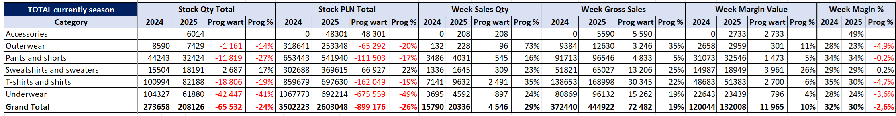

**🔍 Key observations**

- Total inventory decreased from 273,658 units to 208,126 units (-24% YoY), while weekly sales increased from 372,440 to 444,922 units (+19% YoY).
- This shows a strong improvement in inventory productivity, with lower stock generating higher weekly sales.

**Top Weekly Growth Categories**

- T-shirts and shirts: +22% weekly sales

- Sweatshirts and sweaters: +25% weekly sales

- Outerwear: +35% weekly sales

Despite lower stock levels in several categories, demand remained strong, suggesting better assortment selection before the season.

**Margin Peroformance:**

- Weekly margin value increased by +10%
- Margin % decreased from 32% to 30% (-2 pp)

This suggests that sales growth was partly driven by pricing actions or promotions.

**💡 Commercial insight**

The current season assortment generates higher weekly sales with lower inventory levels, indicating better demand alignment and stronger product productivity.


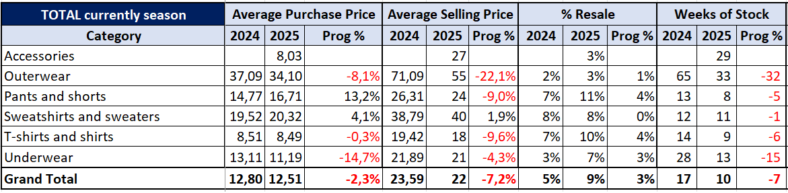

**🔍 Key observations**

- Average selling price decreased from 23.59 to 22.00 (-7%), indicating stronger promotional pressure or pricing adjustments.
- Average purchase price decreased slightly (-2%), suggesting that most of the margin pressure comes from retail price reductions rather than changes in purchasing costs.
- Resale increased from 5% to 9% (+4 pp), indicating faster stock rotation.
- Weeks of stock decreased from 17 to 10 weeks (-7 weeks), confirming a much leaner inventory structure.

**Category observations:**

- Pants and shorts show higher resale (7% → 11%) and lower weeks of stock (13 → 8 weeks), indicating strong demand.
- T-shirts and shirts show improved resale (7% → 10%) with lower stock coverage (14 → 9 weeks).
- Outerwear shows a significant reduction in stock coverage (65 → 33 weeks), indicating strong stock reduction in this category.

**💡 Commercial insight**

Higher resale combined with lower weeks of stock confirms that the assortment is turning faster and carries less overstock risk.

**TOTAL:**

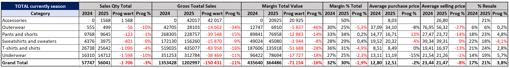

**🔍 Key observations**

- Total sales volume decreased only slightly from 57,747 units to 56,041 units (-3%), despite a 24% reduction in total inventory levels compared to the previous year.
- Gross sales value declined more noticeably (-11% YoY), mainly due to lower average selling prices across several categories.
- Margin value decreased by 16%, while margin percentage declined moderately from 32% to 30% (-2 pp).
- The pricing data confirms a reduction in average selling price (-7%), indicating stronger promotional activity and price adjustments implemented to support sell-through and inventory reduction.

**💡 Commercial insight**

The results reflect a deliberate inventory reduction strategy implemented in 2025.
The company reduced stock levels across stores to eliminate excess inventory from the previous season. Despite this, sales volume remained relatively stable (-3%), suggesting that previous stock levels were higher than needed to support demand.
The data shows that the assortment was better aligned with customer demand, allowing the company to operate with a leaner inventory without significantly impacting sales performance.
At the same time, lower retail prices helped accelerate stock rotation and support the inventory reduction, although this created some pressure on margins.

**STD vs EXC separated**

**Last Week:**

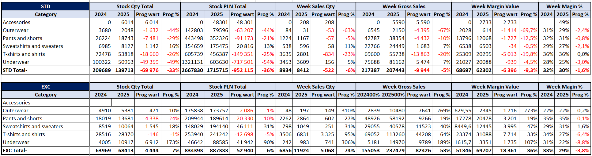

**🔍 Key observations**

The weekly results show different performance dynamics between STD (standard assortment) and EXC (promotional assortment).

STD segment:

- Weekly sales decreased from 8,934 to 8,412 units (-6%)
- Weekly gross sales decreased by -5%
- Weekly margin value decreased by -9%

This reflects a deliberate reduction in stock levels in the core assortment, resulting in slightly lower weekly sales.

EXC segment:

- Weekly sales increased from 6,856 to 11,924 units (+74%)
- Weekly gross sales increased by +53%
- Weekly margin value increased by +36%

This suggests that promotional products played a key role in driving demand during the analyzed week.

**💡 Commercial insight**

The weekly performance shows a clear shift in sales dynamics, where EXC products offset weaker STD sales and supported overall demand despite lower inventory in the core assortment.


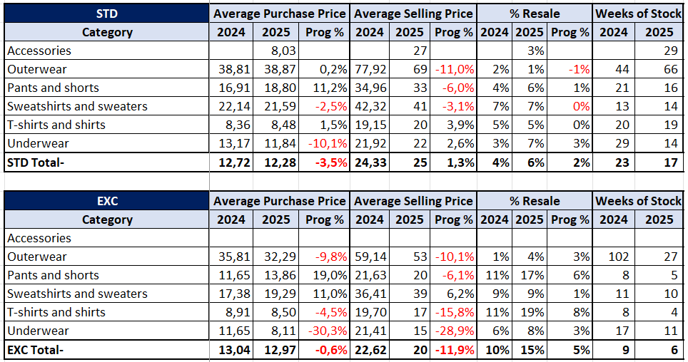

**🔍 Key observations**

💰 Pricing and inventory indicators show clear differences between STD and EXC assortments.

STD segment:

- Average selling price remained relatively stable (+1.3%)
- Resale increased from 4% to 6%
- Weeks of stock decreased from 23 to 17 weeks

This confirms that inventory reduction improved stock turnover in the standard assortment.

EXC segment:

- Average selling price decreased significantly (-11.9%)
- Resale increased from 10% to 15%
- Weeks of stock decreased from 9 to 6 weeks

This suggests that promotional pricing accelerated product rotation, allowing faster inventory reduction and supporting new deliveries.

**💡 Commercial insight**

EXC products show faster inventory turnover, confirming that promotional assortment plays a key role in clearing inventory and supporting sell through.

**TOTAL**
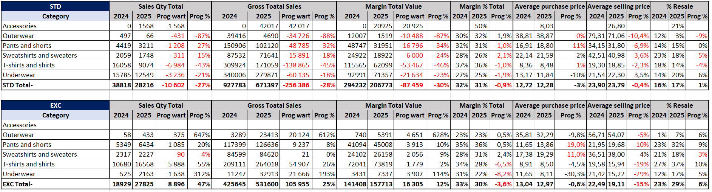

**🔍 Key observations**

The total season results show a clear shift in sales contribution between STD and EXC assortments.

STD segment:

- Sales volume decreased from 38,818 to 28,216 units (-27%)
- Sales value decreased by -28%
- Margin value decreased by -30%

This reflects a deliberate reduction in stock levels within the core assortment.

EXC segment:

- Sales volume increased from 18,929 to 27,825 units (+47%)
- Sales value increased by +25%
- Margin value increased by +12%

This shows that promotional products became a much stronger driver of total sales performance in the current season.

**💡 Commercial insight**

The results suggest that the company reduced exposure to standard inventory while using promotional assortment to maintain sales and improve inventory turnover.


**Country & OLD**

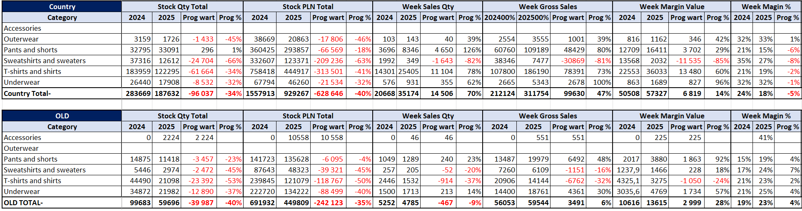

**🔍 Key observations**

The Country assortment shows strong weekly sales dynamics despite a significant reduction in inventory levels.

Total stock decreased from 283,669 to 187,632 units (-34%), while weekly sales increased significantly:
- 20,668 → 35,174 units (+70%)
- Weekly gross sales increased by +47%
- Weekly margin value increased by +14%

The strongest growth was observed in:
- T-shirts and shirts: +78%
- Pants and shorts: +126%
- Underwear: +62%

This shows that locally sourced products generated strong demand during the analyzed week.

**💡 Commercial insight**

Country products play an important role as a flexible supporting assortment, allowing the company to respond quickly to demand and complement the main collection.


The OLD assortment shows typical dynamics for previous season products.

- Inventory decreased from 99,683 to 59,696 units (-40%)
- Weekly sales decreased slightly from 5,252 to 4,785 units (-9%)
- Margin value increased by +28%

This shows that remaining products still generate value despite lower sales volumes.

**💡 Commercial insight**

The OLD assortment is being gradually cleared while still generating margin, suggesting effective inventory reduction without heavy discounting.


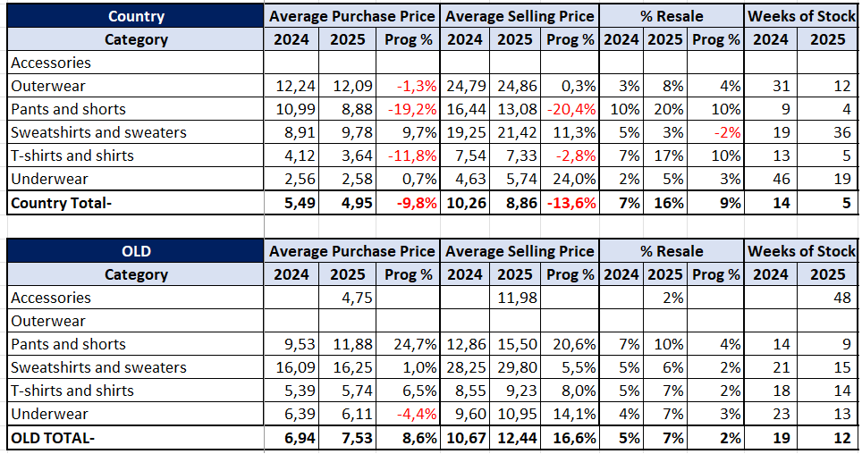

💰 Country – Pricing and Inventory Efficiency


**🔍 Key observations**

Inventory efficiency indicators show a clear improvement in stock turnover.

- Resale increased from 7% to 16%
- Weeks of stock decreased from 14 to 5 weeks

This shows much faster inventory rotation compared to the previous season.

At the same time:

- Average selling price decreased by -13.6%
- Average purchase price decreased by -9.8%

This suggests that pricing adjustments helped stimulate demand while maintaining acceptable margin levels.

**💡 Commercial insight**

Country assortment shows very efficient stock rotation, confirming that locally sourced products can be used to quickly generate sales and improve inventory turnover.

💰 OLD – Pricing and Inventory Efficiency

**🔍 Key observations**

Pricing indicators show moderate adjustments to support sell through of older collections.

- Average selling price increased by +16.6%
- Average purchase price increased by +8.6%

Resale improved slightly:

- 5% → 7%

Weeks of stock decreased from 19 to 12 weeks, indicating a gradual reduction of remaining inventory.

**💡 Commercial insight**

The increase in resale and reduction in weeks of stock suggest that the company is effectively managing the clearance of older collections.


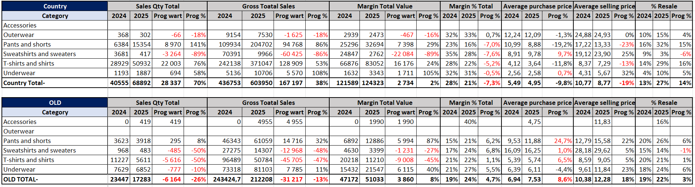

📈 Country – Total Season Performance

**🔍 Key observations**

The total season results show strong growth in the Country assortment:

- Sales volume increased from 40,555 to 68,892 units (+70%)
- Gross sales increased by +38%
- Margin value increased by +2%

Despite strong sales growth, margin % decreased from 28% to 21% (-7 pp).

This suggests stronger price competition and promotional pricing to support demand growth.

**💡 Commercial insight**

The Country assortment significantly increased its share of total sales, suggesting that locally sourced products became an important demand driver during the season.

📈 OLD – Total Season Performance


**🔍 Key observations**

The total season results confirm an ongoing inventory reduction strategy for previous collections.

- Sales volume decreased from 23,447 to 17,283 units (-26%)
- Gross sales decreased by -13%

However:

- Margin value increased by +8%
- Margin % improved from 19% to 24% (+5 pp)

This suggests that despite lower sales volumes, the remaining assortment is being sold with improved profitability.

**💡 Commercial insight**

The OLD assortment is being reduced while maintaining margin performance, indicating effective stock clearance.


**📊 Final Business Insights**

The analysis shows a clear shift in assortment and inventory strategy during the 2025 season.

Total inventory levels were significantly reduced across the business:

- Current Season: −24%
- Country assortment: −34%
- Old collections: −40%

Despite this, sales performance remained relatively stable. Total sales volume for the current season decreased by only −3%, while weekly sales increased by +19%, indicating better alignment between supply and demand.

Sales dynamics shifted across assortment types:

- STD assortment declined (−27% sales volume), mainly due to intentional inventory reduction
- EXC assortment became a key growth driver (+47% sales volume), supported by promotional and licensed products
- Country assortment showed strong growth (+70% sales volume), acting as a flexible complement to the main collection
- OLD assortment continued to decline (−26% sales volume) as part of the inventory reduction strategy

Pricing adjustments also supported demand. Average selling prices decreased across several categories, helping improve inventory turnover and resale.
Overall, the data shows that the company moved toward a leaner and more demand-driven assortment, maintaining stable sales while significantly reducing inventory.

## **📊 Additional Pivot Analysis**

In addition to the main reports, several supplementary pivot tables were created to analyze specific operational aspects from different perspectives.
Pivot tables allow the same dataset to be analyzed in multiple ways depending on the business question. By adjusting dimensions such as category, subcategory, or store, it is possible to quickly evaluate sales efficiency, stock rotation, and performance differences across the network.
The examples below show how the same dataset can be used to create additional views that support deeper operational analysis.


**Category Performance Overview**
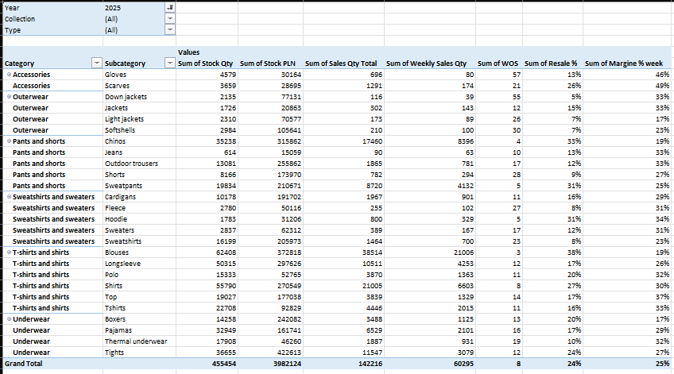

This pivot table presents product performance at the category and subcategory level. It includes key operational metrics such as:

Stock quantity and stock value
Total sales quantity
Weekly sales volume
Weeks of stock (WOS)
Resale rate
Weekly margin

This view allows quick identification of product groups with the strongest sales rotation relative to their stock levels.
Categories such as T-shirts and shirts or Pants and shorts show strong sales volumes and healthy resale rates, indicating stable demand and efficient stock turnover.
Categories with higher WOS and lower resale highlight slower-moving inventory that may require promotional support or assortment adjustments.

**💡 Commercial insight**

Analyzing performance at the category level helps merchandising teams assess whether the assortment is balanced. High resale combined with low WOS typically indicates strong product selection and efficient inventory rotation.


**Store Performance Overview**

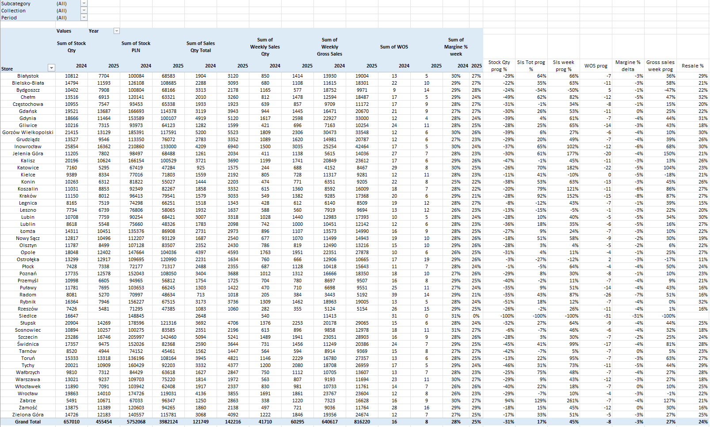

This pivot table analyzes operational performance across the store network.

It compares key indicators such as:

Total stock levels
Sales quantity
Weekly sales activity
Stock coverage (WOS)
Resale rate
Weekly margin

This view helps identify differences in store productivity and stock efficiency.

Some stores show stronger resale rates and faster stock rotation, while others maintain higher stock levels relative to sales. These differences often reflect variations in:

Store size and traffic
Local demand patterns
Assortment allocation
Promotional activity

**💡 Commercial insight**

Store level analysis helps identify high-performing locations as well as stores where stock levels may be too high relative to sales potential. This supports more precise stock allocation and helps optimize inventory distribution across the network.

**Analytical Flexibility**

One of the key advantages of pivot tables is the ability to analyze the same dataset from multiple perspectives.

Depending on business needs, the analysis can be quickly extended to explore:

- Product category performance
- Store network efficiency
- Stock coverage and inventory health
- Margin trends across product groups
- Promotional product impact on sales

The richer the dataset, the more detailed and insightful the analysis becomes. This flexibility makes pivot tables a powerful tool for exploratory analysis and quick operational insights.


## **🚀 Future Business Opportunities**

Based on the results of the analysis, several opportunities for further business and analytical development can be identified.

**Inventory optimization**

The results show that a significant reduction in stock levels did not lead to a proportional decline in sales, suggesting that previous inventory levels were higher than needed.
Further improvements in stock allocation across stores can help maintain availability while improving inventory efficiency. Better alignment between demand and stock distribution would support faster rotation and reduce overstock risk.

**Assortment management**

The results suggest that product selection and collection structure are more important than total stock volume.
Some categories maintained stable sales despite lower inventory, showing that a well-selected assortment can perform efficiently with less stock. This highlights the importance of focusing on product-level decisions within each category rather than increasing total volume.
For buyers and traders, this means focusing more on product selection, collection structure, and demand alignment.

**Promotional and licensing strategy**

The EXC assortment showed strong performance, confirming that promotional and licensed products can effectively drive demand.
A more structured promotional approach could improve results further. Aligning promotions with demand cycles and product availability can support both sales and stock rotation.

**Store level performance optimization**

Store level analysis shows clear differences in resale, stock coverage, and sales performance across the network.
Further analysis can support better store segmentation and more precise stock allocation based on store performance and local demand.

**Advanced analytics and reporting integration**

Further development could include integrating this dataset into BI tools such as Power BI or Tableau.

By combining sales, stock, and supply data in a data model, it would be possible to build a more complete analytical environment, including:

- Sales performance
- Stock levels
- Delivery volumes
- Assortment structure

Analyzing deliveries across different time horizons (weekly, monthly, yearly) would provide additional insight into how supply impacts stock and sales.

This approach would support more data driven decisions and help move toward a more efficient inventory and assortment strategy.

## **📈 Key Analytical Insights**

The analysis highlights several key patterns in sales performance, assortment structure, and inventory management across the retail network.

**Inventory reduction did not significantly impact sales**

The company reduced inventory levels while maintaining stable sales performance.
Total stock decreased by around 24%, while total sales declined by only 3%. This suggests that previous stock levels were higher than needed and that the current assortment operates with a more efficient inventory structure.
This confirms that inventory optimization can improve efficiency without negatively impacting demand.

**Promotional assortment played a key role in sales dynamics**

The EXC assortment (promotional and licensed products) showed strong growth compared to the previous year.
Weekly sales increased significantly, helping maintain overall sales despite lower inventory levels. This shows that promotional products were effectively used to drive demand during the season.
This highlights the importance of structured promotional planning in supporting short term sales.

**Assortment quality proved more important than stock volume**

Product selection and collection structure proved more important than total stock levels.
Several categories maintained stable sales despite reduced inventory, indicating that better assortment planning improved performance at the product level.
This reinforces the importance of data driven assortment decisions based on demand rather than increasing total stock.

**Store level analysis highlights opportunities for allocation improvements**

Store level analysis shows clear differences in resale, stock coverage, and sales performance.
Some stores achieved higher resale with lower stock coverage, indicating more efficient stock rotation. This suggests that improving store-level allocation can further enhance performance.
Better alignment between local demand and stock distribution can increase sales productivity while maintaining optimized inventory levels.


**This project shows how retail sales data can be turned into actionable business insights using Excel based workflows.**


